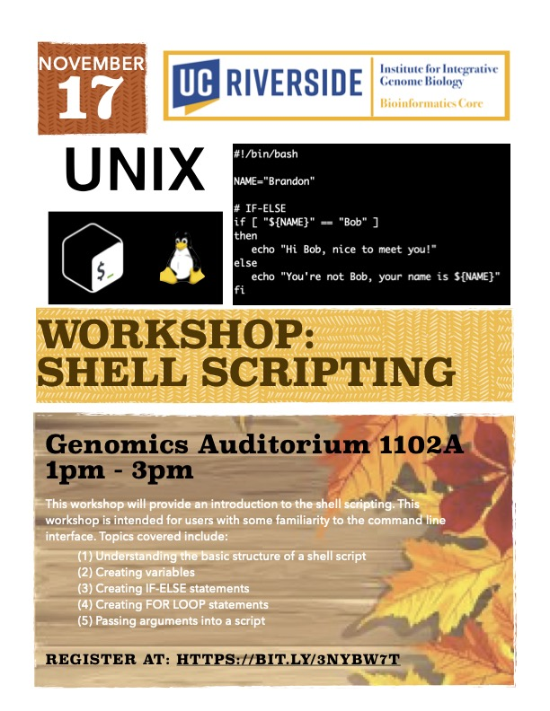

# Intro-to-Shell-Scripting

<figure>

</figure>

This workshop will provide an introduction to shell scripting. This workshop is intended for beginner users with some familiarity with the command line interface. Topics covered in this workshop includes:

- Understanding the basic structure of a shell script
- Creating variables
- Creating IF-ELSE statements
- Creating FOR LOOP statements
- Passing arguments into a script

# General Information  
**Date:** November 17, 2022  
**Time:** 1PM - 3PM  
**Location:** Genomics Auditorium 1102A  
**Format:** In-Person

# Registration
Register for the workshop at: https://bit.ly/3NYBw7T

# Requirements
Attendees should have a laptop (Mac or PC) to follow along in the workshop. If you don’t have a laptop, you can check one out at the [Tomas Rivera](https://library.ucr.edu/libraries/tomas-rivera-library) or [Orbach Science Library](https://library.ucr.edu/libraries/orbach-science-library). Go to the library circulation desk for more information.

**Mac Users:** The MacOS have a built-in terminal program for the command line interface and requires no additional software installation.

**PC Users:** The WinOS does not automatically come with a terminal/shell system pre-installed. For Windows 10 and 11 users, you can follow the instructions in this [link](https://itsfoss.com/install-bash-on-windows/) to install the Linux Bash Shell onto your system.