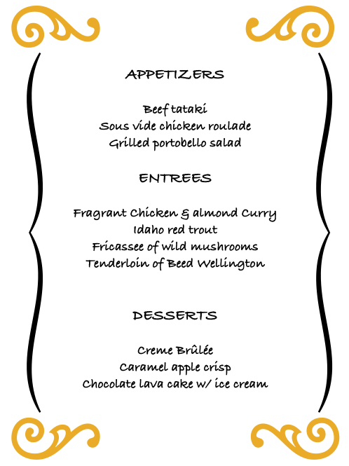

# Practice Session

**Presenter:** Brandon Le  
**Estimated Time:** 30-40 minutes

In this section, you will get into groups of two or three and help each other to create scripts that solves the underlying problem.

## Creating a Bioinformatics Project Directory
---
> You've been hired to analyze new sets of data that's coming steaming hot from the Illumina NextSeq Infinity sequencer. In fact, there are three distinct projects. To keep organize, you want to create a new directory containing sub-folders and files for each project. You're lazy so you want to write a script that will help you to create a project folder, sub-folders and files, that you can re-use for future analysis projects. The project directory should look like the tree below

```
ProjectName
    ├── README.md
    ├── raw
    ├── code
    ├── report
    └── analysis
        ├── analysis1
        ├── analysis2
        ├── analysis3
        ├── analysis4
        └── analysis5
```

The script should do the following:
- Ask the user's input for the directory name
- There should be checks included to make sure the directory doesn't already exist

**Hints:**   

- Use information from lesson **04-for-while-loop** for taking in user's input 
- Use information from lesson **03-if-else-loop** to check file status  
- Use the `mkdir -p` command to create folders and sub-folders (e.g., mkdir folder1/folder2)
- Use the `touch` command to create files (e.g., touch file.txt)

## Creating a Dinner Menu List
---
> We are putting together an extravagant three course wedding dinner venue at the Bel Air Hotel that consists of three appetizers, four main entrees, and three desserts. The caterers would like to have a list of the guest's name and their selections. You're creating a script that your assistance will use for data entry.


<figure>



</figure>

Appetizers:  

    A1 - Beef tataki
    A2 - Sous vide chicken roulade
    A3 - Grilled portebello salad

Entrees:

    E1 - Fragrant chicken and almond curry
    E2 - Idaho Red Trout
    E3 - Fricassee of wild mushrooms
    E4 - Tenderloin of Beef Wellington

Desserts:

    D1 - Creme Brulee
    D2 - Caramel apple crisp
    D3 - Chocolate lava cake with vanilla ice cream

Create a script that will do the following:

  - Take in the user's name and food selection
  - Store the information into a file
  - Repeat for all users within the group
  - To help the assistance from typing in the dishes, you can come up with a numbering system.

Note: All the selection choices should be stored into a single file

**Hints:**   
- Use the ">>" redirection to append a file


## Solutions
---
Below are some solutions for this exercise including solutions provided by workshop attendees.

### Project Directory 
- Solution 1 ([create-proj-directory.sh](../scripts/create-proj-directory.sh))

- Solution 2 ([create-proj-directory-student1.sh](../scripts/create-proj-directory-student1.sh))

- Solution 3 ([create-proj-directory-student2.sh](../scripts/create-proj-directory-student2.sh))


### Dinner menu - 

- Solution 1 ([create-dinner-menu.sh](../scripts/create-dinner-menu.sh))

- Solution 2 ([create-dinner-menu-student1.sh](../scripts/create-dinner-menu-student1.sh))

- Solution 3 ([create-dinner-menu-student2.sh](../scripts/create-dinner-menu-student2.sh))
